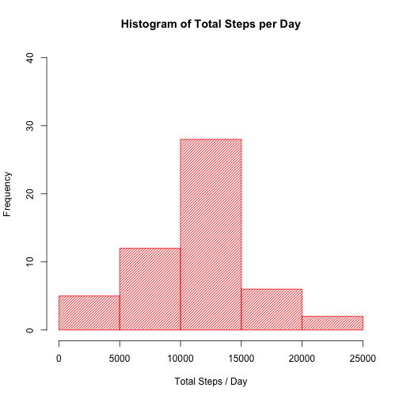
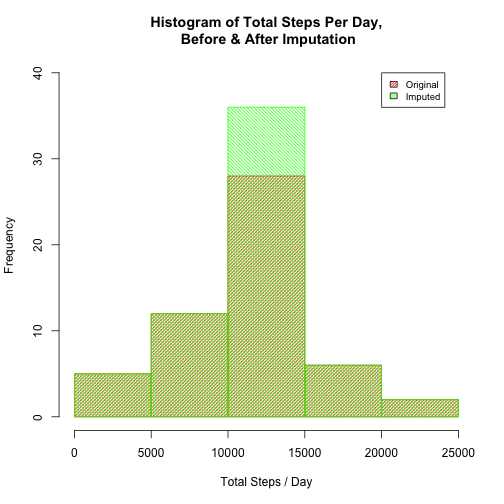

---

## Introduction

This is the submission for [Assignment 1](https://class.coursera.org/repdata-032/human_grading/view/courses/972599/assessments/3/submissions) of Reproducible Research course Johns Hopkins University on Coursera.

## Data

We are using a dataset of observations from a personal activity monitoring device. This device collects data at 5 minute intervals through out the day. The data consists of two months of data from an anonymous individual collected during the months of October and November, 2012 and include the number of steps taken in 5 minute intervals each day.

The variables included in this dataset are:

- steps: Number of steps taking in a 5-minute interval (missing values are coded as NA)
- date: The date on which the measurement was taken in YYYY-MM-DD format
- interval: Identifier for the 5-minute interval in which measurement was taken

The dataset is stored in a comma-separated-value (CSV) file and there are a total of 17,568 observations in this dataset.

The dataset used in this analysis is included in the fork of the [GitHub repository which was created for this assignment] (http://github.com/rdpeng/RepData_PeerAssessment1).

The file, activity.csv is timestamped Feb 11, 2015 24:08:20. The MD5 fingerprint of the file is 4e6514217ad89f2108479a47758c5d8c.

## Report

### Loading & Preprocessing Data


```r
# Data file location
dataFile <- "./activity.csv"

# Load libraries
options(scipen=1)
library(lattice)

# Load the data
dataSet <- read.csv(dataFile)

# Preprocessing: 
# -convert date column to date class
dataSet$date <- as.Date(dataSet$date)
```
### What is mean total number of steps taken per day?

***1. Calculate the total number of steps taken per day***


```r
  totalStepsPerDay <- aggregate(dataSet$steps,by=list(dataSet$date),sum)

  # give descriptive column names 
  names(totalStepsPerDay) <- c("date","total_steps")

  # The total number of steps per day is given by the following table:
  knitr::kable(totalStepsPerDay)
```


|date       | total_steps|
|:----------|-----------:|
|2012-10-01 |          NA|
|2012-10-02 |         126|
|2012-10-03 |       11352|
|2012-10-04 |       12116|
|2012-10-05 |       13294|
|2012-10-06 |       15420|
|2012-10-07 |       11015|
|2012-10-08 |          NA|
|2012-10-09 |       12811|
|2012-10-10 |        9900|
|2012-10-11 |       10304|
|2012-10-12 |       17382|
|2012-10-13 |       12426|
|2012-10-14 |       15098|
|2012-10-15 |       10139|
|2012-10-16 |       15084|
|2012-10-17 |       13452|
|2012-10-18 |       10056|
|2012-10-19 |       11829|
|2012-10-20 |       10395|
|2012-10-21 |        8821|
|2012-10-22 |       13460|
|2012-10-23 |        8918|
|2012-10-24 |        8355|
|2012-10-25 |        2492|
|2012-10-26 |        6778|
|2012-10-27 |       10119|
|2012-10-28 |       11458|
|2012-10-29 |        5018|
|2012-10-30 |        9819|
|2012-10-31 |       15414|
|2012-11-01 |          NA|
|2012-11-02 |       10600|
|2012-11-03 |       10571|
|2012-11-04 |          NA|
|2012-11-05 |       10439|
|2012-11-06 |        8334|
|2012-11-07 |       12883|
|2012-11-08 |        3219|
|2012-11-09 |          NA|
|2012-11-10 |          NA|
|2012-11-11 |       12608|
|2012-11-12 |       10765|
|2012-11-13 |        7336|
|2012-11-14 |          NA|
|2012-11-15 |          41|
|2012-11-16 |        5441|
|2012-11-17 |       14339|
|2012-11-18 |       15110|
|2012-11-19 |        8841|
|2012-11-20 |        4472|
|2012-11-21 |       12787|
|2012-11-22 |       20427|
|2012-11-23 |       21194|
|2012-11-24 |       14478|
|2012-11-25 |       11834|
|2012-11-26 |       11162|
|2012-11-27 |       13646|
|2012-11-28 |       10183|
|2012-11-29 |        7047|
|2012-11-30 |          NA|

***2. Make a histogram of the total number of steps taken per day***


```r
hist(totalStepsPerDay$total_steps,ylim=c(0,40),col=rgb(1,0,0,1),density=30,main="Histogram of Total Steps per Day",xlab="Total Steps / Day")
```

 

***3. Mean & median of the total number of steps taken per day***


```r
  totalStepsPerDay.mean <- mean(totalStepsPerDay$total_steps,na.rm=TRUE)
  totalStepsPerDay.median <- median(totalStepsPerDay$total_steps,na.rm=TRUE)
```

- Mean of the total number of steps taken per day: ***``10766.1886792``***
- Median of the total number of steps taken per day: ***``10765``***

### What is the average daily activity pattern?

***1. Make a time series plot (i.e. type = "l") of the 5-minute interval
(x-axis) and the average number of steps taken, averaged across all days (y-axis)***


```r
  dailyActivity <- aggregate(dataSet$steps,list(dataSet$interval),mean, na.rm=TRUE)
  names(dailyActivity) <- c("interval","steps")

  # make a time column based on the interval values
  # so that R will plot the x-axis as Hour and Minutes instead of base-10 integers
  dailyActivity$time <- formatC(dailyActivity$interval, width = 4, format = "d", flag = "0")
  dailyActivity$time <- sub("([[:digit:]]{2,2})$", ":\\1", dailyActivity$time) 
  dailyActivity$time <- as.POSIXct(dailyActivity$time,format="%H:%M",tz="UTC")

  plot(x = dailyActivity$time, y=dailyActivity$steps,type="l",main="Average Daily Activity",ylab="Number of Steps",xlab="Time of Day")
```

 

***2. Which 5-minute interval, on average across all the days in the dataset,
contains the maximum number of steps?***


```r
  idx.max <- dailyActivity[which.max(dailyActivity[,"steps"]),"interval"]
  idx.max
```

```
## [1] 835
```

The interval at ***``835``*** has the maximum number of steps. 

### Imputing missing values

***1. Calculate and report the total number of missing values in the dataset
(i.e. the total number of rows with NAs)***


```r
  incomplete = length(dataSet[is.na(dataSet)])
  incomplete
```

```
## [1] 2304
```

There are ***``2304``*** missing values.

***2. Devise a strategy for filling in all of the missing values in the dataset.
The strategy does not need to be sophisticated. For example, you could use the
mean/median for that day, or the mean for that 5-minute interval, etc.***

- It is reasonable to assume most populations of people have common and predictable routine of activities according by societal norms (e.g. sleep, go to work/school, exercise, socialise), and so the imputation strategy would provide data as could be expected from a typical day.
 
- Therefore assuming a typical subject's behaviour will be similar
  during the same interval of time of every day, then we take the mean for 
  each 5-minute interval over all days to fill in missing values.
  

-  We can use the same values of mean steps per interval, as calculated
  earlier in dailyActivity to replace the NA step values corresponding
  to the interval column. 

***3. Create a new dataset that is equal to the original dataset but with the missing data filled in.***


```r
  dataSet2 <- dataSet
  dataSet2.idx_na <- which(is.na(dataSet2$steps),arr.ind=TRUE)

  # cross reference the interval value in the dataset and dailyActivity
  for (i in dataSet2.idx_na) {
    interval <- dataSet2[i,c("interval")]
    val <- dailyActivity[dailyActivity$interval==interval,c("steps")]
    dataSet2[i,c("steps")] <- val
  }
```

***4. Make a histogram of the total number of steps taken each day and Calculate and report the mean and median total number of steps taken per day.***


```r
totalStepsPerDay2 <- aggregate(dataSet2$steps,by=list(dataSet$date),sum)
names(totalStepsPerDay2) <- c("date","total_steps")

hist(totalStepsPerDay2$total_steps,ylim=c(0,40),col=rgb(0,1,0,1),density=30,angle=135, main="Histogram of Total Steps per Day (Imputed)",xlab="Total Steps / Day")
```

 


```r
totalStepsPerDay2.mean <- mean(totalStepsPerDay2$total_steps)
totalStepsPerDay2.median <- median(totalStepsPerDay2$total_steps)
```

- Mean of the total number of steps taken per day (imputed): ***``10766.1886792``***
- Median of the total number of steps taken per day (imputed): ***``10766.1886792``***

***Do these values differ from the estimates from the first part
of the assignment?*** 


```r
# comparing histograms
totalStepsPerDay.compare <- cbind(totalStepsPerDay,totalStepsPerDay2$total_steps)
names(totalStepsPerDay.compare) <- c("date","original","imputed")

hist(totalStepsPerDay.compare$original,ylim=c(0,40), col=rgb(1,0,0,1),density=30,main="Histogram of Total Steps Per Day,\n Before & After Imputation",xlab="Total Steps / Day")

hist(totalStepsPerDay.compare$imputed,ylim=c(0,40),col=rgb(0,1,0,1),density=30,angle=135,add=TRUE)

legend(20000,40,legend=c("Original","Imputed"),density=40,fill=c(rgb(1,0,0,1),rgb(0,1,0,1)),cex=0.8)
```

 

```r
# making a comparison table
comparison <- matrix(c(totalStepsPerDay.mean,totalStepsPerDay.median,totalStepsPerDay2.mean,totalStepsPerDay2.median),ncol=2)
comparison<-data.frame(comparison)
colnames(comparison)<-c("original","imputed")
rownames(comparison)<-c("mean","median")
comparison$delta <- comparison$imputed - comparison$original
comparison$delta_pct <- (comparison$delta/comparison$original)*100

knitr::kable(comparison)
```


|       | original|  imputed|    delta| delta_pct|
|:------|--------:|--------:|--------:|---------:|
|mean   | 10766.19| 10766.19| 0.000000| 0.0000000|
|median | 10765.00| 10766.19| 1.188679| 0.0110421|

***What is the impact of imputing missing data on the
estimates of the total daily number of steps?***

In the first estimate, missing values were filtered out. After imputation, these values were given by the average number of steps taken over all days, which means that the new values are exactly the population mean. The mean value before and after imputation is exactly the same. In other words, the imputation did not introduce any significant bias.

The median value also shifted only very slightly, because the additional values are the mean of the population.

### Are there differences in activity patterns between weekdays and weekends?

***1. Create a new factor variable in the dataset with two levels – “weekday” and “weekend”
indicating whether a given date is a weekday or weekend day.***


```r
  # As advised by TA, to ensure reproducibility across locales,
  # explicitly set the locale to en_US.
  # See: https://class.coursera.org/repdata-032/forum/thread?thread_id=10

  olocale<-Sys.getlocale("LC_TIME") # save the current locale
  Sys.setlocale("LC_TIME","en_GB")

  day <- weekdays(dataSet2$date)
  is_weekday <- day %in% c("Monday","Tuesday","Wednesday","Thursday","Friday")
  dataSet2$dayType <- factor(is_weekday,labels=c("weekend","weekday"))
 
  # reset the locale to its original setting
  Sys.setlocale("LC_TIME",locale=olocale)
```

This provides us with a data frame that has the following structure 

```
## 'data.frame':	17568 obs. of  4 variables:
##  $ steps   : num  1.717 0.3396 0.1321 0.1509 0.0755 ...
##  $ date    : Date, format: "2012-10-01" "2012-10-01" ...
##  $ interval: int  0 5 10 15 20 25 30 35 40 45 ...
##  $ dayType : Factor w/ 2 levels "weekend","weekday": 2 2 2 2 2 2 2 2 2 2 ...
```

***2. Make a panel plot containing a time series plot (i.e. type = "l") of the 5-minute
interval (x-axis) and the average number of steps taken, averaged across all weekday
days or weekend days (y-axis).***


```r
  weekpartActivity <- aggregate(dataSet2$steps,list(dataSet2$interval,dataSet2$dayType),mean, na.rm=TRUE)
  names(weekpartActivity) = c("interval","dayType","steps")

  # make a time column based on the interval values
  # so that R will plot the x-axis as Hour and Minutes instead of base-10 integers

  weekpartActivity$time <- formatC(weekpartActivity$interval, width = 4, format = "d", flag = "0")
  weekpartActivity$time <- sub("([[:digit:]]{2,2})$", ":\\1", weekpartActivity$time) 
  weekpartActivity$time <- as.POSIXct(weekpartActivity$time,format="%H:%M",tz="UTC")

  # also used this method to prepare the x-axis labels
  # from: http://stackoverflow.com/questions/19872477/format-time-series-in-lattice
  xscale <- seq(weekpartActivity$time[1], by="1 hour", length=25)
  
  xyplot(data=weekpartActivity,
         steps ~ time | dayType,
         type="l",
         layout=c(1,2),
         scales = list(
           x = list(
             at=xscale,
             labels=format(xscale,"%H:%M"),
             rot=90
             )
           ),
         main = "Comparison of Activity on Weekdays vs Weekends",
         ylab="Steps",
         xlab="Time of Day"
         )
```

 

## References
1. [Source GitHub Repository](https://github.com/rdpeng/RepData_PeerAssessment1)
2. [Format time series in lattice](http://stackoverflow.com/questions/19872477/format-time-series-in-lattice)
